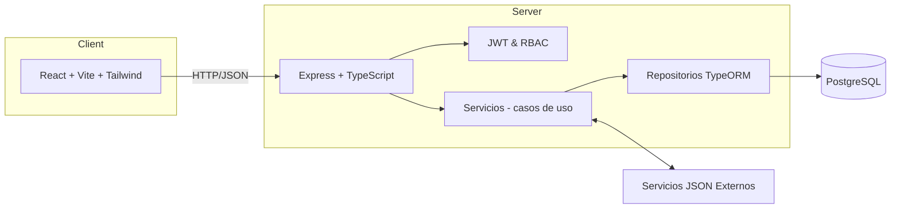

# Arquitectura General

## Visión
Aplicación web responsive para gestionar facturación y módulos relacionados; backend API REST con autenticación JWT y RBAC; integración con servicios JSON externos.

## Diagrama de arquitectura (Mermaid)

## Módulos
- Autenticación y gestión de usuarios/roles (Admin, Analista)
- Facturación, Anulaciones, Radicación, Medicamentos, Ventas, Configuración
- Control JSON (import/export)

## Tecnologías
- Frontend: React + Vite + TS + Tailwind
- Backend: Node.js + Express + TS + TypeORM
- DB: PostgreSQL
- Auth: JWT
- Docs: OpenAPI/Swagger
- DevOps: Docker, Compose
