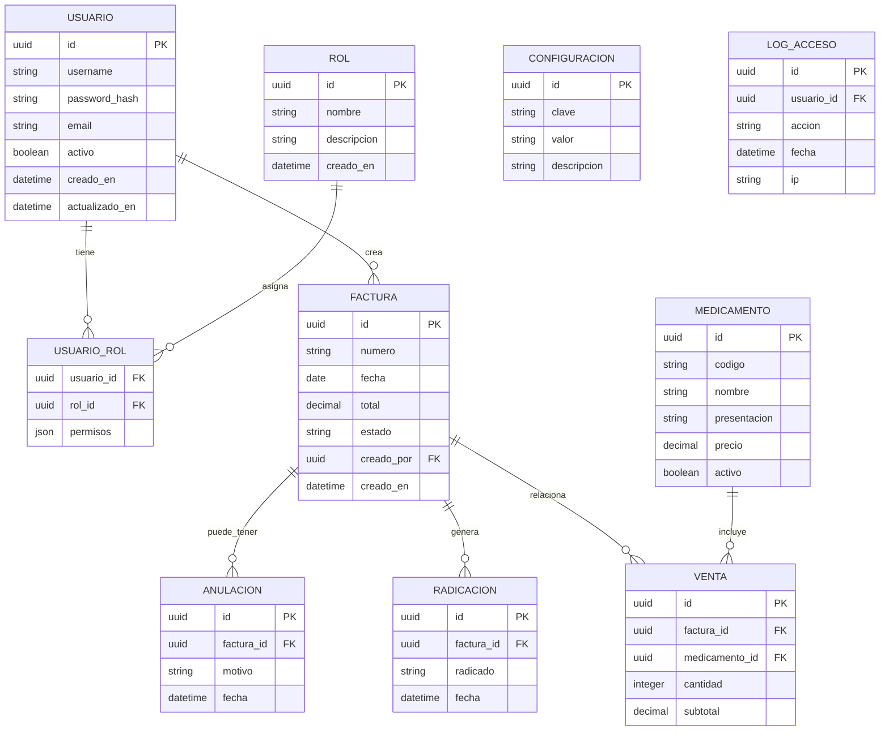

# ERD - Control Facturación

```mermaid
erDiagram
  USUARIO ||--o{ USUARIO_ROL : tiene
  ROL ||--o{ USUARIO_ROL : asigna
  USUARIO ||--o{ FACTURA : crea
  FACTURA ||--o{ ANULACION : puede_tener
  FACTURA ||--o{ RADICACION : genera
  FACTURA ||--o{ VENTA : relaciona
  MEDICAMENTO ||--o{ VENTA : incluye

  USUARIO {
    uuid id PK
    string username
    string password_hash
    string email
    boolean activo
    datetime creado_en
    datetime actualizado_en
  }
  ROL {
    uuid id PK
    string nombre
    string descripcion
    datetime creado_en
  }
  USUARIO_ROL {
    uuid usuario_id FK
    uuid rol_id FK
    json permisos
  }
  FACTURA {
    uuid id PK
    string numero
    date fecha
    decimal total
    string estado
    uuid creado_por FK
    datetime creado_en
  }
  ANULACION {
    uuid id PK
    uuid factura_id FK
    string motivo
    datetime fecha
  }
  RADICACION {
    uuid id PK
    uuid factura_id FK
    string radicado
    datetime fecha
  }
  MEDICAMENTO {
    uuid id PK
    string codigo
    string nombre
    string presentacion
    decimal precio
    boolean activo
  }
  VENTA {
    uuid id PK
    uuid factura_id FK
    uuid medicamento_id FK
    integer cantidad
    decimal subtotal
  }
  CONFIGURACION {
    uuid id PK
    string clave
    string valor
    string descripcion
  }
  LOG_ACCESO {
    uuid id PK
    uuid usuario_id FK
    string accion
    datetime fecha
    string ip
  }
```
