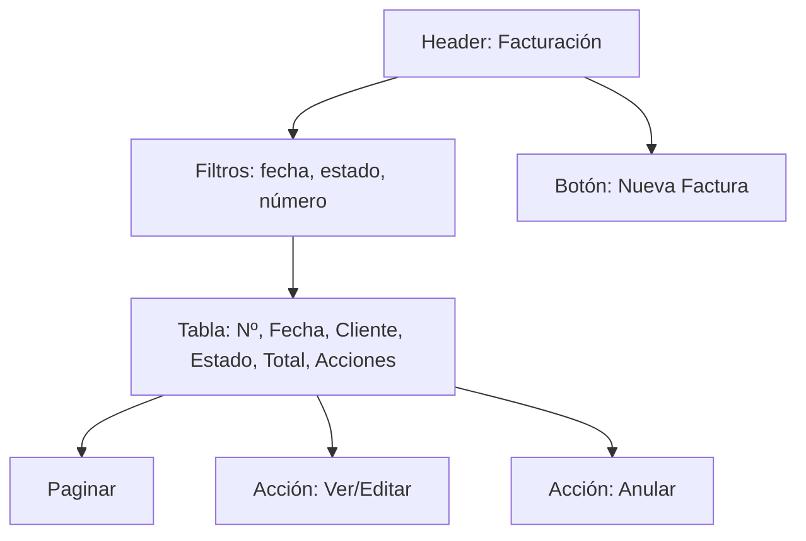
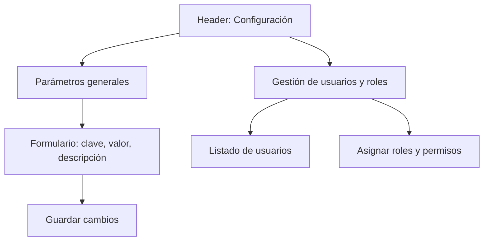

# Wireframes

## Barra superior
```mermaid
flowchart LR
  A[Barra superior fija] --> B(Título: Control Facturación)
  A --> C(Menu: Facturación | Anulaciones | Radicación | Medicamentos | Venta | Configuración | Control JSON)
  A --> D(Perfil/Logout)
```

## Sección: Facturación (lista)


## Sección: Configuración

